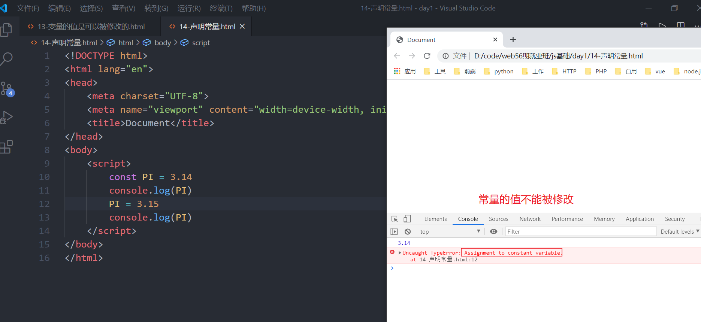

# JS的第一天

## JS的书写位置

- 嵌入式 

  1. 在html页面上面创建一个`script`标签，然后在其里面写JS的代码，这个script标签可以放在html页面的任何位置，只不过建议 放在结束的body标签的前面
  
  2. 可以放置多个script标签
  
     ```html
     <!DOCTYPE html>
     <html lang="en">
     <head>
         <meta charset="UTF-8">
         <meta name="viewport" content="width=device-width, initial-scale=1.0">
         <title>Document</title>
     </head>
     <body>
         <script>
             // 警告 在浏览器上面弹出一个警告框 
             alert('hello world!')
         </script>
         <script>
             // 在浏览器的控制台中的console选项卡输出我们想要的内容
             console.log('小强别跑!!!')
         </script>
     </body>
     </html>
     ```


- 外链式

   可以将JS代码放在一个单独的JS文件中，需要创建一个以js为扩展名的文件，然后将JS代码放进去，所以最后需要将JS文件引入到HTML页面中。

  语法：

  ```html
  <script src="需要引入的JS文件的路径"></script>
  ```

  一个HTML文件可以引入多个JS文件

关于嵌入式与外链式的注意点：

CSS中 嵌入式使用是 `<style></style>`  外链式是使用`<link >`

我们发现嵌入式和外链式它们都是采用的`script`标签

不能在一个标签里面既外链式又嵌入式

## 输入输出语句

### 输出语句

```js
// 1. 在浏览器中弹出一个警告框
alert('弹出的内容')
// 2. 在浏览器的开发者工具中的 console选项卡输出内容
console.log('要输出的内容')
// 3. 在浏览器的body标签中输出内容
document.write('要输出的内容')
```

```html
<!DOCTYPE html>
<html lang="en">
  <head>
    <meta charset="UTF-8" />
    <meta name="viewport" content="width=device-width, initial-scale=1.0" />
    <title>Document</title>
  </head>
  <body>
    <script>
      // 1. 在浏览器中弹出一个警告框
      alert("教师节");
      // 2. 在浏览器的开发者工具中的 console选项卡输出内容
      console.log("要输出的内容");
      // 3. 在浏览器的body标签中输出内容
      document.write("<h2>胡歌</h2>");
    </script>
  </body>
</html>

```

### 输入语句

```js
// 在浏览器弹出一个输入的对话框
prompt('提示信息')
```

```html
<!DOCTYPE html>
<html lang="en">
<head>
    <meta charset="UTF-8">
    <meta name="viewport" content="width=device-width, initial-scale=1.0">
    <title>Document</title>
</head>
<body>
    <script>
        prompt('请输入您的银行卡密码')
    </script>
</body>
</html>
```

## 变量

为什么需要有变量？

方便对数据进行管理，增删改查

变量主要的作用就是用于存放数据，变量是保存在内存中。

**增**声明变量

语法：

```js
// 先声明
var 变量名
// 后赋值
变量名 = 值
// 变量的初始化
var 变量名 = 值
```

注意：声明变量时一定要有`var`关键字


代码：

```html
<!DOCTYPE html>
<html lang="en">
<head>
    <meta charset="UTF-8">
    <meta name="viewport" content="width=device-width, initial-scale=1.0">
    <title>Document</title>
</head>
<body>
    <script>
        // 声明一个变量来保存pink老师
        var uname = 'pink老师';
        var age = 18
        // 如果我们要输出的是变量，就直接写变量名就可以了
        console.log(uname, age);
        // console.log('uname');

    </script>
</body>
</html>
```

变量的案例：

```html
<!DOCTYPE html>
<html lang="en">
<head>
    <meta charset="UTF-8">
    <meta name="viewport" content="width=device-width, initial-scale=1.0">
    <title>Document</title>
</head>
<body>
    <script>
        // 我叫旗木卡卡西，我住在火影村， 我今年30岁了， 我的邮箱是 kakaxi@itcast.cn， 我的工资2000
        var uname = '旗木卡卡西';
        var address = '火影村';
        var age = 30;
        var email = 'kakaxi@itcast.cn';
        var salary = 2000;

        console.log(uname,address,age,email,salary)
    </script>
</body>
</html>
```

**改** 修改变量的值


**常量**

在实现生活有一些数据是不能够进行修改的，ES6给我们程序员增加了一个声明变量的新的关键字 

常量的值是不能进行修改的 

```js
const 常量名 = 值
```



**删** 将一个变量删除  基本上用不到

语法：

```html
delete 变量名
```

同时声明多个变量  

同时声明多个变量时， 只需要写一个 var， 多个变量名之间使用英文逗号隔开。

```js
var uname = '张三', age = 18 , sex = '男', address = '火影村';
console.log(uname,age,sex,address)
```

注意点：

1. 变量只声明没有赋值，使用这个变量就会得到`undefined`


2. 不要使用一个没有初始化的变量  会报错


3. 变量名的前面需要加`var`关键字

案例：

交换两个变量的值

```html
<!DOCTYPE html>
<html lang="en">
<head>
    <meta charset="UTF-8">
    <meta name="viewport" content="width=device-width, initial-scale=1.0">
    <title>Document</title>
</head>
<body>
    <script>
        // 交换两个变量的值 第一步需要先初始化两个变量
        var num1 = 10;
        var num2 = 20;

        // 第一步：先声明一个临时变量 
        var temp;
        // 第二步：将num2的变量的值赋值给临时变量
        temp = num2
        // 第三步：将num1的变量的值赋值给num2
        num2 = num1;
        // 第四步：将临时变量的值赋值给 num1 
        num1 = temp;

        console.log(num1);
        console.log(num2);
    </script>
</body>
</html>
```

## 数据类型

JS是一门弱类型的脚本语言，变量的类型是其值来决定的。并且类型是可以改变的

数据类型分为两大类：

简单数据类型：Number 、String、Boolean、null、undefined

复杂数据类型：Object

### 数字型 number

包含：正整数、负整数、小数，NaN 

在js有一个关键字可以它可以检测变量是什么数据类型

语法：

```js
var 变量名 = typeof 要检测的变量名  // 将检测变量的结果赋值给等于号左边的变量名
```


证明：变量的值如果是NaN 它是不是Number数据类型 


#### isNaN()  了解

用户判断一个变量是不是NaN，如果是NaN就会得到`true`，如果是数字就会得到 `false`

语法：

```js
var 变量名 = isNaN(要判断变量名)
```

### 字符串 String

凡是用单引号或者双引号包裹的内容都称之为字符串，不管引号里面包裹是什么。

注意点：

1. 如果单引号里面需要出现引号 里面的引号需要使用双引号   单包双
2. 如果双引号里面需要出现引号，里面的引号就需要是单引号  双包单

关于换行的问题：

如果我们是通过`console.log`或者`alert`来输出 这个时候需要换行就要使用转义字符 `\n`

如果我们是通过`document.write`来输出的，如果我们需要换行可以使用` <br>`


获取字符串的长度  **重点**

语法：

```js
字符串的变量.length 
```

```html
<!DOCTYPE html>
<html lang="en">
<head>
    <meta charset="UTF-8">
    <meta name="viewport" content="width=device-width, initial-scale=1.0">
    <title>Document</title>
</head>
<body>
    <script>
        var str = '01-JS初体验.html'
        var len = str.length; // 将得到的结构赋值给变量 len
        console.log(len)

    </script>
</body>
</html>
```

字符串拼接 

字符串可以和任意类型进行拼接  

字符串  +  任意类型  =  新的字符串

- 多个字符串之间可以使用 + 进行拼接，其拼接方式为 字符串 + 任何类型 = 拼接之后的新字符串  
- 拼接前会把与字符串相加的任何类型转成字符串， 再拼接成一个新的字符串  

字符串如果与变量名进行拼接：字符串  + 变量名

引引加加 

```html
<!DOCTYPE html>
<html lang="en">
<head>
    <meta charset="UTF-8">
    <meta name="viewport" content="width=device-width, initial-scale=1.0">
    <title>Document</title>
</head>
<body>
    <script>
        // 在一个定义的好字符串 如果出现了变量 那么这个变量会不会被解析
        // JS中 如果一个字符串里面出现了变量 这个变量不会被解析的 
        var uname = '张三';
        var str = '他的名字叫'+uname+'，他今年18岁了';
        console.log(str)
    </script>
</body>
</html>
```


ES6给我们新增一个叫模板字符串

模板字符串它在定义字符串的时候 用的反引号 

以后我们一个字符串里面有变量名需要解析 这个时候我们在定义字符串的时候不要使用单引号也不要使用双引号使用模板字符串的方式来定义

```js
var uname = '张三';
var age = 18;
var str = `他的姓名是${uname}他今年${age}岁了`
```

 