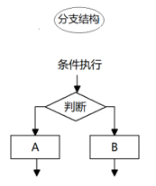

# JS的第二天

## Boolean 布尔类型 重点

 表示真与假，这个类型的变量的值只有两个：`true和false`

true表示真 

false表示假


## undefined  未定义 了解

如何得到未定义的数据类型？

1. 声明变量，不赋值，我们直接使用这个变量 就可以得到 `undefined`
2. 变量初始化的时候，变量的值为 `undefined`

```js
var flag = undefined
```

## null 空型 了解

如何得到null的数据类型？

> 只需要将变量的值设置为 `null` 就可以

简单数据类型：number、string、boolean

## 数据类型的转换

显示转换：程序员通过JS给我们提供的一个工具将一个类型转换为另外一个转换

隐式转换：根据程序的上下文的环境，代码在执行的过程中将一个类型转换为另外一个类型 比如isNaN

**转换为字符串**


- toString() 和 String()  使用方式不一样。
- 三种转换方式，更多第三种加号拼接字符串转换方式， 这一种方式也称之为隐式转换。

重点：需要记住第一种和第三种

```html
<!DOCTYPE html>
<html lang="en">
<head>
    <meta charset="UTF-8">
    <meta name="viewport" content="width=device-width, initial-scale=1.0">
    <title>Document</title>
</head>
<body>
    <script>
        var num = 100
        // 将任何一种类型都可以转换为 字符串  变量名.toString()
        // var res = num.toString()

        // console.log(typeof res)
        // var res1 = String(num)
        var res = num + '' 
        console.log(typeof res)
    </script>
</body>
</html>
```

**转换为数字型**


- Number(要转换的类型)  可以将其它的类型转换为数字型  如果可以转换为对应的数字 就会直接转换为数字，如果转换不了就会转换为NaN   Not a Number
  - 如果将一个字符串转换为数字，字符串有非数字的任何字符 那么这个字符串就会被转换为 NaN 
  - 如果一个字符串里面 它的内容是纯数字  -----> 转换为对应的数字
  - 布尔类型： true----->1   false ----->0   重点
  -  null类型： null -----> 0 
  -  undefined:  undefined -----> NaN

parseInt(要转换的变量) 从一个变量中提取整数 如果这个变量是一个字符串 并且字符串的第一个字符不是数字 那么就会得到NaN 如果这个字符串的第一个字符是数字 就开始进行提取整数 直到遇到了非数字就停止提取


parseFloat(要转换的变量) 从一个变量中提取小数 如果这个变量是一个字符串 并且字符串的第一个字符不是数字 那么就会得到NaN 如果这个字符串的第一个字符是数字 就开始进行提取整数 直到遇到了除了第一个点以外的数字就停止提取


**转换为布尔类型**


将其它的类型转换为布尔型

1. 将Number类型转换为布尔类型  除了 0 与NaN以外 其它的数字都会被转换为 `true`
2. 将String类型转换为布尔类型   只要这个字符串里面有内容就会被转换为 `true`  空字符串它就会被转换为`false`
3. 将undefined类型转换为布尔类型  结果为 false
4. 将null类型转换为了布尔类型 结果为 false


## 运算符

- 算术运算符
  - 加  + 
  - 减 - 
  - 乘 * 
  - 除 /
  - 求余 取模  % 

- 加加运算符  ++  自加1 
  - 前加加和后加加   
  - 前加加  加加符号在变量的前面   ++a
  - 后加加  加加符号在变量的后面   a++

     **不管是前加加还是后加加，如果它们自己单独进行运算 它们都会进行加1**
  
     只不过它们的区别在于 赋值 
  
  

- - 减减运算符  --  
  - 前减减和后减减 它的运算规则与加加运算符一模一样 


- 比较运算符

  概念：比较运算符（关系运算符）是两个数据进行比较时所使用的运算符，比较运算后，会返回一个布尔值（true / false）作为比较运算的结果。
  
  我们给定 x = 5，下表中解释了比较运算符：

| 运算符 | 描述                 | 比较      | 返回  |
| :----- | :------------------- | :-------- | :---- |
| ==     | 等于                 | x == 8    | false |
|        |                      | x == 5    | true  |
|        |                      | x == "5"  | true  |
| ===    | 值相等并且类型相等   | x === 5   | true  |
|        |                      | x === "5" | false |
| !=     | 不相等               | x != 8    | true  |
| !==    | 值不相等或类型不相等 | x !== 5   | false |
|        |                      | x !== "5" | true  |
|        |                      | x !== 8   | true  |
| >      | 大于                 | x > 8     | false |
| <      | 小于                 | x < 8     | true  |
| >=     | 大于或等于           | x >= 8    | false |
| <=     | 小于或等于           | x <= 8    | true  |

- 逻辑运算符
  - 逻辑与    &&        要求 && 左右两边的表达式的结果同时为真 那么才为真    只有一种情况为 true 同时都为true 其它的情况都是 false
  - 逻辑或    ||         要求 || 左右两边的表达式的结果只要有一边为真 就为真  只有一种情况为 false  就是都是false的时候 结果就是false  其它的情况都是 真   
  - 逻辑非  !变量名     如果变量名的值为true 就会得到 false  反之 如果这个变量的值为 false 就会得到 true 

逻辑与除了得到 true或者 false以外 还可能得到其它的结果

逻辑与规则：

- 如果第一个表达式的结果为真 不管第二个表达式的值是真的还是假的  那么就会得到 第二个表达式的值 
- 如果第一个表达式的结果为假，不管第二个表达式的值是真的还是假的 都会得到 第一个表达式的值 

逻辑或除了得到 true或者 false以外 还可能得到其它的结果

逻辑或规则：

- 如果第一个表达式的结果为真 不管第二个表达式的值是真的还是假的  那么就会得到 第一个表达式的值 
- 如果第一个表达式的结果为假，不管第二个表达式的值是真的还是假的 都会得到 第二个表达式的值 

`逻辑与`与`逻辑或`的规则刚好相反 

现阶段我们用到的逻辑运算符得到的结果都是 true| false 

- 赋值运算符

给定 *x=10* 和 *y=5*，下面的表格解释了赋值运算符：

| 运算符 | 例子 | 等价于 | 结果 |
| ------ | ---- | ------ | ---- |
| =      | x=y  |        | x=5  |
| +=     | x+=y | x=x+y  | x=15 |
| -=     | x-=y | x=x-y  | x=5  |
| *=     | x*=y | x=x*y  | x=50 |
| /=     | x/=y | x=x/y  | x=2  |
| %=     | x%=y | x=x%y  | x=0  |

注意点：

1. += 这些符号要连着一起写 
2. += 左边的变量名前面不要有var关键字 因为它是在使用变量 不是声明变量

 += 还可以实现字符串拼接

## 2 - 流程控制

### 2.1 流程控制概念

	在一个程序执行的过程中，各条代码的执行顺序对程序的结果是有直接影响的。很多时候我们要通过控制代码的执行顺序来实现我们要完成的功能。
	
	简单理解：**流程控制就是来控制代码按照一定结构顺序来执行**
	
	流程控制主要有三种结构，分别是**顺序结构**、**分支结构**和**循环结构**，代表三种代码执行的顺序。


### 2.2 顺序流程控制

​	

​	顺序结构是程序中最简单、最基本的流程控制，它没有特定的语法结构，程序会按照代码的先后顺序，依次执行，程序中大多数的代码都是这样执行的。
​                

### 2.3 分支流程控制

- 分支结构

  由上到下执行代码的过程中，根据不同的条件，执行不同的路径代码（执行代码多选一的过程），从而得到不同的结果
                  

	JS 语言提供了两种分支结构语句：if 语句、switch 语句

- if 语句 (单分支)

  - 语法结构

  ```js
  // 条件成立执行代码，否则什么也不做
  if (条件表达式) {
      // 条件成立执行的代码语句
  }
  ```

  	语句可以理解为一个行为，循环语句和分支语句就是典型的语句。一个程序由很多个语句组成，一般情况下，会分割成一个一个的语句。

  - 执行流程

    

代码：

```html
<!DOCTYPE html>
<html lang="en">
<head>
    <meta charset="UTF-8">
    <meta name="viewport" content="width=device-width, initial-scale=1.0">
    <title>Document</title>
</head>
<body>
    <script>
        // 如果考试分数是100分 那么我们就在控制台中打印满分 
        // 1 要求分数是输入的 
        // 2. 判断分数是不是 100 
        var fenshu = prompt('请输入你的考试成绩');
        // 如果 条件语句成立 得到布尔类型的true 这个时候 大括号里面代码才会执行
        if (fenshu == 100) {
            console.log('满分')
        }

    </script>
</body>
</html>
```


if else语句（双分支语句）

- 语法结构

  ```js
  // 条件成立  执行 if 里面代码，否则执行else 里面的代码
  if (条件表达式) {
      // [如果] 条件成立执行的代码
  } else {
      // [否则] 执行的代码
  }
  ```

- 执行流程

  


代码：

```html
<!DOCTYPE html>
<html lang="en">
<head>
    <meta charset="UTF-8">
    <meta name="viewport" content="width=device-width, initial-scale=1.0">
    <title>Document</title>
</head>
<body>
    <script>
        /*
            if (条件语句) {
                如果条件语句成立 就会执行这里
            } else {
                否则 不成功 就会执行这里
            }
        */
        // 如果考试分数 大于等于 60 分 我们就输出 及格万岁 
        // 否则 就输出 渣渣 落后要挨打
        var score = prompt('请输入你的考试成绩')

        if (score >= 60) {
            console.log('及格万岁')
        } else {
            console.log('渣渣 落后要挨打')
        }
        
    </script>
</body>
</html>
```

