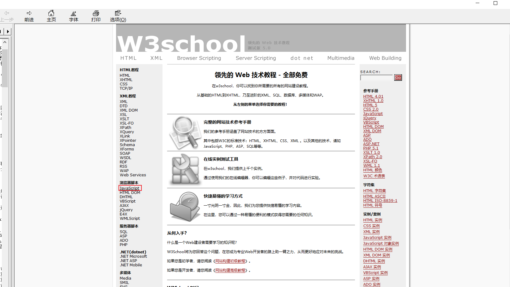
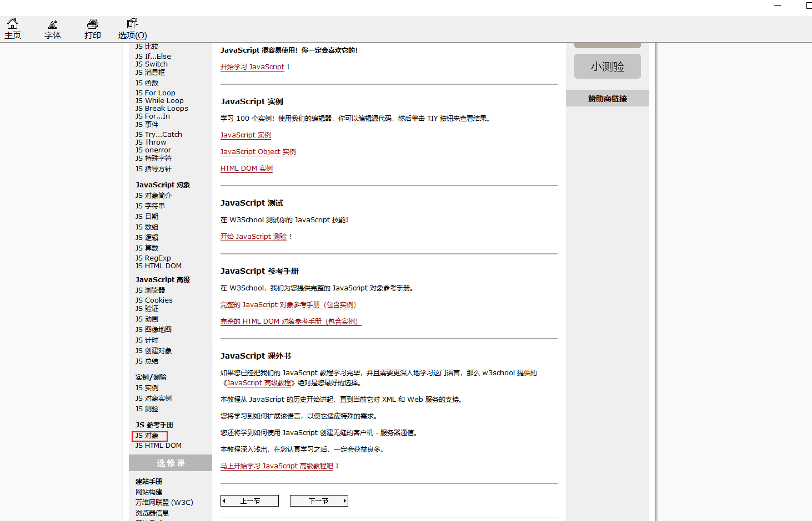
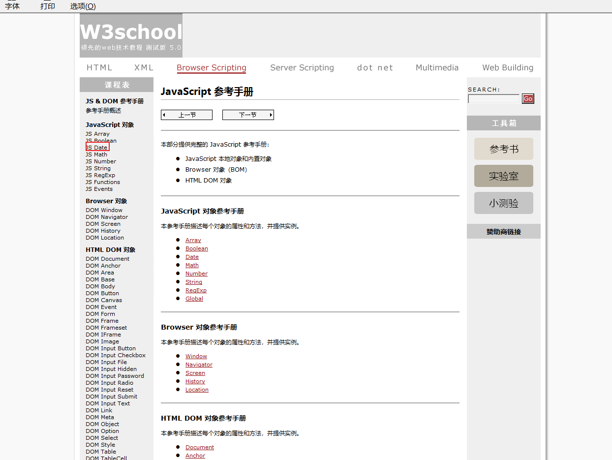

# JavaScript基础第03天

## 1 - 运算符（操作符）

### 1.1 运算符的分类

**运算符**（operator）也被称为操作符，是用于实现赋值、比较和执行算数运算等功能的符号。

	JavaScript中常用的运算符有：

-  算数运算符
-  递增和递减运算符
-  比较运算符
-  逻辑运算符
-  赋值运算符

### 1.2 算数运算符

- 算术运算符概述

  概念：算术运算使用的符号，用于执行两个变量或值的算术运算。

  

- 浮点数的精度问题

  浮点数值的最高精度是 17 位小数，但在进行算术计算时其精确度远远不如整数。

  ```js
  var result = 0.1 + 0.2;    // 结果不是 0.3，而是：0.30000000000000004
  console.log(0.07 * 100);   // 结果不是 7，  而是：7.000000000000001
  ```

  所以：不要用浮点数来进行运算

- 表达式和返回值

  表达式：是由数字、运算符、变量等以能求得数值的有意义排列方法所得的组合

  简单理解：是由数字、运算符、变量等组成的式子

  表达式最终都会有一个结果，返回给开发者，称为返回值

### 1.3 递增和递减运算符

- 递增和递减运算符概述

  	如果需要反复给数字变量添加或减去1，可以使用递增（++）和递减（ -- ）运算符来完成。

    	在 JavaScript 中，递增（++）和递减（ -- ）既可以放在变量前面，也可以放在变量后面。放在变量前面时，我们可以称为前置递增（递减）运算符，放在变量后面时，我们可以称为后置递增（递减）运算符。
	
    	注意：递增和递减运算符必须和变量配合使用。 

- 递增运算符

  - 前置递增运算符

  	++num 前置递增，就是自加1，类似于 num =  num + 1，但是 ++num 写起来更简单。
					
  	使用口诀：先自加，后返回值

  ```js
  var  num = 10;
  alert(++num + 10);   // 21
  ```

  - 后置递增运算符

    num++ 后置递增，就是自加1，类似于 num =  num + 1 ，但是 num++ 写起来更简单。

    使用口诀：先返回原值，后自加 

  ```js
  var  num = 10;
  alert(10 + num++);  // 20
  ```

### 1.4 比较运算符

- 比较运算符概述

  	概念：比较运算符（关系运算符）是两个数据进行比较时所使用的运算符，比较运算后，会返回一个布尔值（true / false）作为比较运算的结果。

  

- 等号比较

  

  ```js
  console.log(18 == '18');
  console.log(18 === '18'); 
  ```

### 1.5 逻辑运算符

- 逻辑运算符概述

  	概念：逻辑运算符是用来进行布尔值运算的运算符，其返回值也是布尔值。后面开发中经常用于多个条件的判断

  

- 逻辑与&&

  两边都是 true才返回 true，否则返回 false  

  只有一种情况下是true  两边都是 true才返回 true  其它的情况都是false  
  
  
  ​                
  
  ​                
  
- 逻辑或 ||

  只要有一边为true，那么就是true，只有一种情况为false 就是两边为false 结果才为false 

  只有一种情况为false  就是两边都为false就是false 其它的情况都是true 
  
  
  ​                
  
  ​                
  
- 逻辑非 ！

  逻辑非（!）也叫作取反符，用来取一个布尔值相反的值，如 true 的相反值是 false

  ```js
  var isOk = !true;
  console.log(isOk);  // false
  ```

- 短路运算（逻辑中断）

   短路运算的原理：当有多个表达式（值）时,左边的表达式值可以确定结果时,就不再继续运算右边的表达式的值;

  - 逻辑与

      语法： 表达式1 && 表达式2

          - 如果第一个表达式的值为真，则返回表达式2
          
          - 如果第一个表达式的值为假，则返回表达式1

      ```js
      console.log( 123 && 456 );        // 456
      console.log( 0 && 456 );          // 0
      console.log( 123 && 456&& 789 );  // 789
      ```

  - 逻辑或

     语法： 表达式1 || 表达式2

         - 如果第一个表达式的值为真，则返回表达式1
         
         - 如果第一个表达式的值为假，则返回表达式2

      ```js
      console.log( 123 || 456 );         //  123
      console.log( 0 ||  456 );          //  456
      console.log( 123 || 456 || 789 );  //  123
      ```

### 1.6 赋值运算符

	概念：用来把数据赋值给变量的运算符。


```js
var age = 10;
age += 5;  // 相当于 age = age + 5;
age -= 5;  // 相当于 age = age - 5;
age *= 10; // 相当于 age = age * 10;
```

### 1.7 运算符优先级


- 一元运算符里面的逻辑非优先级很高
- 逻辑与比逻辑或优先级高

## 2 - 流程控制

### 2.1 流程控制概念

	在一个程序执行的过程中，各条代码的执行顺序对程序的结果是有直接影响的。很多时候我们要通过控制代码的执行顺序来实现我们要完成的功能。
	
	简单理解：**流程控制就是来控制代码按照一定结构顺序来执行**
	
	流程控制主要有三种结构，分别是**顺序结构**、**分支结构**和**循环结构**，代表三种代码执行的顺序。


### 2.2 顺序流程控制

​	

​	顺序结构是程序中最简单、最基本的流程控制，它没有特定的语法结构，程序会按照代码的先后顺序，依次执行，程序中大多数的代码都是这样执行的。
​                

### 2.3 分支流程控制

- 分支结构

  由上到下执行代码的过程中，根据不同的条件，执行不同的路径代码（执行代码多选一的过程），从而得到不同的结果
                  

	JS 语言提供了两种分支结构语句：if 语句、switch 语句

- if 语句 (单分支)

  - 语法结构

  ```js
  // 条件成立执行代码，否则什么也不做
  if (条件表达式) {
      // 条件成立执行的代码语句
  }
  ```

  	语句可以理解为一个行为，循环语句和分支语句就是典型的语句。一个程序由很多个语句组成，一般情况下，会分割成一个一个的语句。

  - 执行流程

    

- if else语句（双分支语句）

  - 语法结构

    ```js
    // 条件成立  执行 if 里面代码，否则执行else 里面的代码
    if (条件表达式) {
        // [如果] 条件成立执行的代码
    } else {
        // [否则] 执行的代码
    }
    ```
  
- 执行流程
  
  
  
- if else if 语句(多分支语句)

  - 语法结构

    ```js
    // 适合于检查多重条件。
    if (条件表达式1) {
        语句1；
    } else if (条件表达式2)  {
        语句2；
    } else if (条件表达式3)  {
       语句3；
     ....
    } else {
        // 上述条件都不成立执行此处代码
    }
    
    ```

  - 执行逻辑

    


想要获取到电脑的系统时间







接下来 我们需要创建一个Date对象 

```js
var myDate = new Date()
```

从这个时间日期对象里面获取今天星期几 

``` js
var week = myDate.getDay() // 将得到的星期几赋值给变量week 
```

得到是一个数字：0~6之间的一个整数  0表示星期天  1表示星期一  

代码如下：

```html
<!DOCTYPE html>
<html lang="en">
<head>
    <meta charset="UTF-8">
    <meta name="viewport" content="width=device-width, initial-scale=1.0">
    <title>Document</title>
</head>
<body>
    <script>
        // 第一步：得到一个时间日期对象
        var myDate = new Date()
        // 第二步：通过时间日期对象得到今天星期几 
        var week = myDate.getDay()
        // console.log(week)
        if (week === 1) {
            console.log('打羽毛球')
        } else if (week === 2) {
            console.log('打篮球')
        } else if (week === 3) {
            console.log('打乒乓球')
        } else if (week === 4) {
            console.log('打台球')
        } else if (week === 5) {
            console.log('打麻将')
        } else {
            console.log('写代码')
        }


    </script>
</body>
</html>
```

根据考试的成绩来判断是否是优秀、中等、良好、及格、渣渣

如果考试的分数的大于等于90 打印优秀

如果考试的分数的大于等于80 并且 小于90 打印中等

如果考试的分数的大于等于70 并且小于 80 打印良好

如果考试的分数的大于等于60 并且小于 70 打印及格

否则就是打印渣渣辉

```html
<!DOCTYPE html>
<html lang="en">
  <head>
    <meta charset="UTF-8" />
    <meta name="viewport" content="width=device-width, initial-scale=1.0" />
    <title>Document</title>
  </head>
  <body>
    <script>
      /*
        根据考试的成绩来判断是否是优秀、中等、良好、及格、渣渣

        如果考试的分数的大于等于90 打印优秀

        如果考试的分数的大于等于80 并且 小于90 打印中等

        如果考试的分数的大于等于70 并且小于 80 打印良好

        如果考试的分数的大于等于60 并且小于 70 打印及格

        否则就是打印渣渣辉
        需要有一个输入框 让用户输入分数
        限定用户输入的成绩 必须在 0~100之间 

        比如我们去高铁站坐高铁 
        检票：看看你是否买了高铁票 如果有 才放你进去 

        */
      var score = prompt("请输入分数");

      if (score >= 0 && score <= 100) {
        if (score >= 90) {
          document.write("优秀");
        } else if (score >= 80 ) {
          document.write("中等");
        } else if (score >= 70 ) {
          document.write("良好");
        } else if (score >= 60 ) {
          document.write("及格");
        } else {
          document.write("渣渣，问题不大，还需要努力");
        }
      } else {
        alert("请输入合法的分数");
      }
    </script>
  </body>
</html>

```


### 2.4 三元表达式

- 语法结构

  ```js
  表达式1 ? 表达式2 : 表达式3;
  ```

- 执行思路

  - 如果表达式1为 true ，则返回表达式2的值，如果表达式1为 false，则返回表达式3的值
  - 简单理解： 就类似于  if  else （双分支） 的简写

### 2.5 switch分支流程控制

- 语法结构

  	switch 语句也是多分支语句，它用于基于不同的条件来执行不同的代码。当要针对变量设置一系列的特定值的选项时，就可以使用 switch。

  ```js
  switch( 表达式 ){ 
      case value1:
          // 表达式 等于 value1 时要执行的代码
          break;
      case value2:
          // 表达式 等于 value2 时要执行的代码
          break;
      default:
          // 表达式 不等于任何一个 value 时要执行的代码
  }
  ```

  - switch ：开关 转换  ， case ：小例子   选项

  - 关键字 switch 后面括号内可以是表达式或值， 通常是一个变量

  - 关键字 case , 后跟一个选项的表达式或值，后面跟一个冒号

  - switch 表达式的值会与结构中的 case 的值做比较 

  - 如果存在匹配全等(===) ，则与该 case 关联的代码块会被执行，并在遇到 break 时停止，整个 switch 语句代码执行结束

  - 如果所有的 case 的值都和表达式的值不匹配，则执行 default 里的代码

    **注意： 执行case 里面的语句时，如果没有break，则继续执行下一个case里面的语句。**

- switch 语句和 if else if 语句的区别

  - 一般情况下，它们两个语句可以相互替换
  - switch...case 语句通常处理 case为比较确定值的情况， 而 if…else…语句更加灵活，常用于范围判断(大于、等于某个范围)
  - switch 语句进行条件判断后直接执行到程序的条件语句，效率更高。而if…else 语句有几种条件，就得判断多少次。
  - 当分支比较少时，if… else语句的执行效率比 switch语句高。
  - 当分支比较多时，switch语句的执行效率比较高，而且结构更清晰。 

## 3 - 循环

什么是循环：在满足一定的条件下，重复去执行某些代码 

如果没有条件，就是死循环 

for 、while 、do....while

for循环的基本语法：

```js
for(变量初始化;条件表达式;变量更新){
    循环体 // 重复执行的代码
}
```

第一步：先声明一个变量，然后给这个变量赋值   只执行一次

第二步：声明的这个变量是否满足指定的条件，如果条件成立

第三步：只要条件条件表达式成立 执行循环体 

第四步：对声明变量的值进行更新，回到第二步 继续看看变量的值是否满足指定的条件，如果满足执行循环体 循环体执行完了 对就是的值再次进行更新，直到条件表达式不成立了就不再执行循环体 for循环就停止了


打印1~100之间所有的数字 

```html
<!DOCTYPE html>
<html lang="en">
  <head>
    <meta charset="UTF-8" />
    <meta name="viewport" content="width=device-width, initial-scale=1.0" />
    <title>Document</title>
  </head>
  <body>
    <script>
      // 打印1~100之间所有的数字
      for (var i = 1; i <= 100; i++) {
        console.log(i);
      }
    </script>
  </body>
</html>

```

打印1~100之间所有的偶数

```html
<!DOCTYPE html>
<html lang="en">
  <head>
    <meta charset="UTF-8" />
    <meta name="viewport" content="width=device-width, initial-scale=1.0" />
    <title>Document</title>
  </head>
  <body>
    <script>
      // 打印1~100之间所有的偶数
      // 1. 先要有 1~100之间所有的数
      // 2. 从这些数中找出哪些数字是偶数 应该拿这些数字  % 2 === 0 如果余数为0就表示它是偶数
      for (var i = 1; i <= 100; i++) {
        // 需要判断哪些数字是偶数 单分支
        if (i % 2 === 0) {
          document.write(i + "<br>");
        }
      }
    </script>
  </body>
</html>
```

统计1~100之间偶数的个数

```html
<!DOCTYPE html>
<html lang="en">
<head>
    <meta charset="UTF-8">
    <meta name="viewport" content="width=device-width, initial-scale=1.0">
    <title>Document</title>
</head>
<body>
    <script>
        // 统计1~100之间偶数的个数
        var count = 0; // 用于统计个数
        // 写一个for循环 
        for(var i = 1; i<=100;i++) {
            // 看看这个数字是不是偶数
            if(i % 2 === 0) {
                count++;
            }
        }
    </script>
</body>
</html>
```

求1~100之间所有数的和

```html
<!DOCTYPE html>
<html lang="en">
  <head>
    <meta charset="UTF-8" />
    <meta name="viewport" content="width=device-width, initial-scale=1.0" />
    <title>Document</title>
  </head>
  <body>
    <script>
      // 1. 需要有 1~100之间所有的数字
      // 2. 我们需要定义一个变量来得到每一次 变量i相加的和
      var sum = 0;
      for (var i = 1; i <= 100; i++) {
        /*
            当 i = 1  但是有一个问题马上变量的i变成了2了  如何拿到第一次i与第二次的i进行相加呢？
            我们应该将上次的变量i的值保存起来 任何数 + 0 = 任何数本身 
            循环的第一次 i = 1   为了保存第一次变量i的值  sum = 0 + 1 = i 
            循环的第二次 i = 2   我们就可以拿到上一次变量i的值与这一次i的值进行相加以后将其结果保存起来 sum = 1 + 2 
            循环的第二次 i = 3   我们就可以拿到上一次sum的值 (前两次i相加的和) 加上 这一次变量i的值   sum = sum +　i 

        */
        // sum = sum + i  sum += i
        sum += i;
      }

      document.write(sum);
    </script>
  </body>
</html>

```

目标就是为了完成99乘法表

第一步：先打印1行1列的表格

```html
<!DOCTYPE html>
<html lang="en">
<head>
    <meta charset="UTF-8">
    <meta name="viewport" content="width=device-width, initial-scale=1.0">
    <title>Document</title>
    <style>
        table {
            width: 600px;
            border: 1px solid #000;
            /* 合并表格的边框线 */
            border-collapse: collapse;
            margin: 0 auto;
        }
        td {
            border: 1px solid #000;
        }
    </style>
</head>
<body>
    <script>
        var str = '<table>';
            str += '<tr><td>&nbsp;</td></tr>';
            str += '</table>';
        document.write(str)
    </script>
</body>
</html>
```

第二步：先打印9行1列的表格

```html
<!DOCTYPE html>
<html lang="en">
  <head>
    <meta charset="UTF-8" />
    <meta name="viewport" content="width=device-width, initial-scale=1.0" />
    <title>Document</title>
    <style>
      table {
        width: 600px;
        border: 1px solid #000;
        /* 合并表格的边框线 */
        border-collapse: collapse;
        margin: 0 auto;
      }
      td {
        border: 1px solid #000;
      }
    </style>
  </head>
  <body>
    <script>
      // 为了完成9行1列的表格 需要对 行进行循环 循环9次  str += '<tr><td>&nbsp;</td></tr>'; 当作为循环的循环体
      var str = "<table>";
      for (var i = 1; i <= 9; i++) {
        str += "<tr><td>&nbsp;</td></tr>";
      }
      str += "</table>";
      document.write(str);
    </script>
  </body>
</html>

```

第三步：打印1行9列的表格

```html
<!DOCTYPE html>
<html lang="en">
  <head>
    <meta charset="UTF-8" />
    <meta name="viewport" content="width=device-width, initial-scale=1.0" />
    <title>Document</title>
    <style>
      table {
        width: 600px;
        border: 1px solid #000;
        /* 合并表格的边框线 */
        border-collapse: collapse;
        margin: 0 auto;
      }
      td {
        border: 1px solid #000;
      }
    </style>
  </head>
  <body>
    <script>
      // 为了完成打印1行9列的表格 需要对 列进行循环 列是 <td></td>
      // str += "<td>&nbsp;</td>"; 把它当作为循环体
      var str = "<table>";
      str += "<tr>";
      for (var i = 1; i <= 9; i++) {
        str += "<td>&nbsp;</td>";
      }
      str += "</tr>";
      str += "</table>";
      document.write(str);
    </script>
  </body>
</html>
```

第四步：打印9行9列的表格

打印9行一列，然后1行9列 这两个代码组合在一起就可以形成9行9列的表格了

```html
<!DOCTYPE html>
<html lang="en">
  <head>
    <meta charset="UTF-8" />
    <meta name="viewport" content="width=device-width, initial-scale=1.0" />
    <title>Document</title>
    <style>
      table {
        width: 600px;
        border: 1px solid #000;
        /* 合并表格的边框线 */
        border-collapse: collapse;
        margin: 0 auto;
      }
      td {
        border: 1px solid #000;
      }
    </style>
  </head>
  <body>
    <script>
      // 第一步：我们需要先对行进行循环
      var str = "<table>";
      // 这个循环是在对 表格的 行进行循环  外面的循环循环了一次 里面的循环9次
      // 当代码执行到下一行时 定义一个变量i = 1  1 <=9 条件语句成文就执行循环体
      // 外层循环在控制 表格的 行  内层循环在控制表格的列
      for (var i = 1; i <= 9; i++) {
        str += "<tr>";
        // 列也需要循环9次 把列表当作为循环体
        // 定义一个变量 j = 1 1 <= 9 就执行循环体
        for (var j = 1; j <= 9; j++) {
          str += "<td>&nbsp;</td>";
        }
        str += "</tr>";
      }
      str += "</table>";
      document.write(str);
    </script>
  </body>
</html>

```

第五步：打印99乘法表

99乘法表 

第一行只有1个列

第二行只有2个列

第三行只有3个列

列的数量是由内层循环来决定 

```html
<!DOCTYPE html>
<html lang="en">
  <head>
    <meta charset="UTF-8" />
    <meta name="viewport" content="width=device-width, initial-scale=1.0" />
    <title>Document</title>
    <style>
      table {
        width: 800px;
        border: 1px solid #000;
        /* 合并表格的边框线 */
        border-collapse: collapse;
        margin: 0 auto;
      }
      td {
        border: 1px solid #000;
        text-align: center;
      }
      .style-red {
        color: red;
      }
    </style>
  </head>
  <body>
    <script>
      /*
      第一行只有1个列
      第二行只有2个列
      第三行只有3个列
      当变量i的值等于1时 就表示表格的第一行  又因为第一行里面只有一个列 也就意味着内层循环只能循环一次
      当变量i的值等于2时 就表示表格的第二行  又因为第二行里面只有二个列 也就意味着内层循环只能循环二次
      当变量i的值等于3时 就表示表格的第三行  又因为第三行里面只有三个列 也就意味着内层循环只能循环三次
      .....
      */
      var str = "<table>";

      for (var i = 1; i <= 9; i++) {
        str += "<tr>";
        for (var j = 1; j <= i; j++) {
          str += `<td>${j}&times;${i}= ${i * j}</td>`;
        }
        str += "</tr>";
      }
      str += "</table>";
      document.write(str);
    </script>
  </body>
</html>

```

作业：

使用for循环完成鸡兔同笼的案例

*今有雉兔同笼，上有三十五头，下有九十四足，问雉兔各几何？*

这四句话的意思是：

有若干只鸡兔同在一个笼子里，从上面数，有35个头，从下面数，有94只脚。问笼中各有多少只鸡和兔？

穷举法：

先假设鸡有1只 ，兔子有34只  ，看看腿是否满足94条腿  `1*2 + 34*4 === 94`

先假设鸡有2只 ，兔子有33只  ，看看腿是否满足94条腿  `2*2 + 33*4 === 94`


水仙花数

在100到999之间有这样的几个数字，它们的个位数的3次方加上十位数的3次方加上百位数的3次方刚才等于这个数字 这样的数字就称之为水仙花数

使用for循环打印下面的图型

```html
*
***
*****
*******
*********

    *
   ***
  *****
 *******
*********


    *
   * *
  *   *
 *     *
*********


    *
   *  *
  *    *
 *      *
*        *
 *      *
  *    *
   *  *
     *
```


