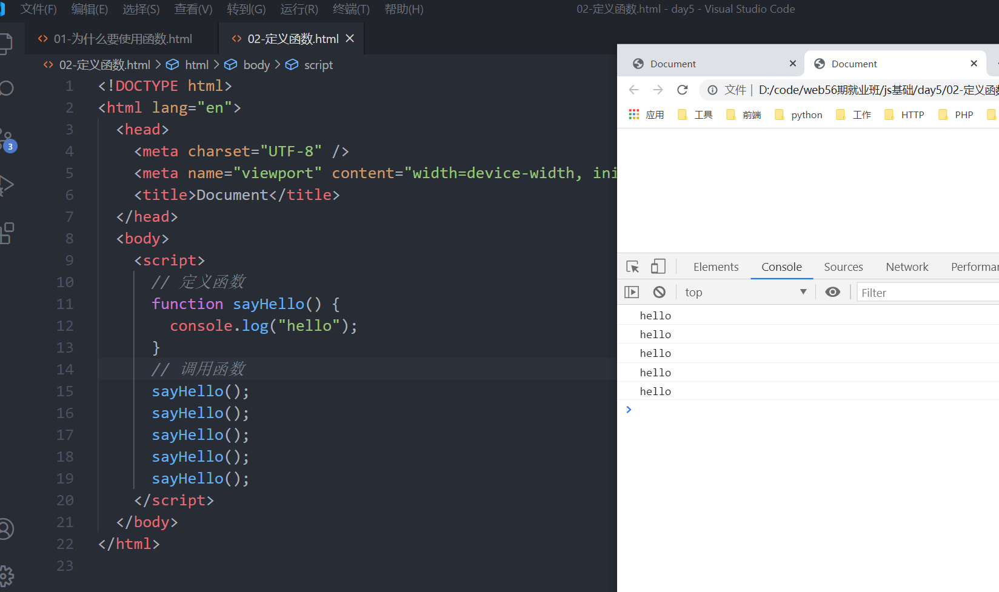
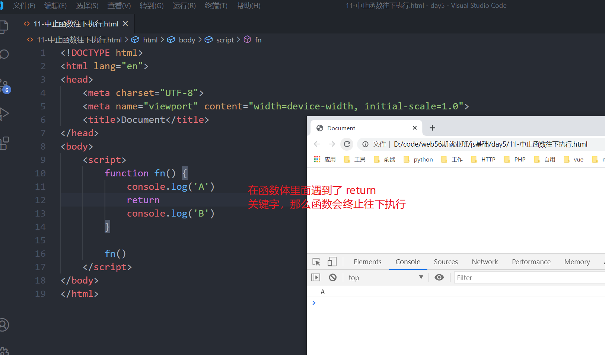
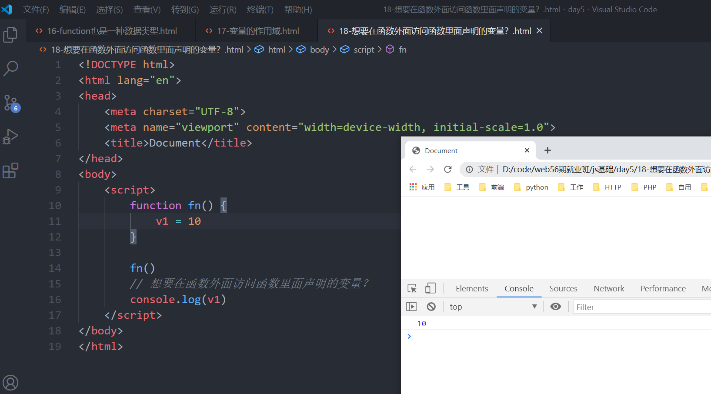
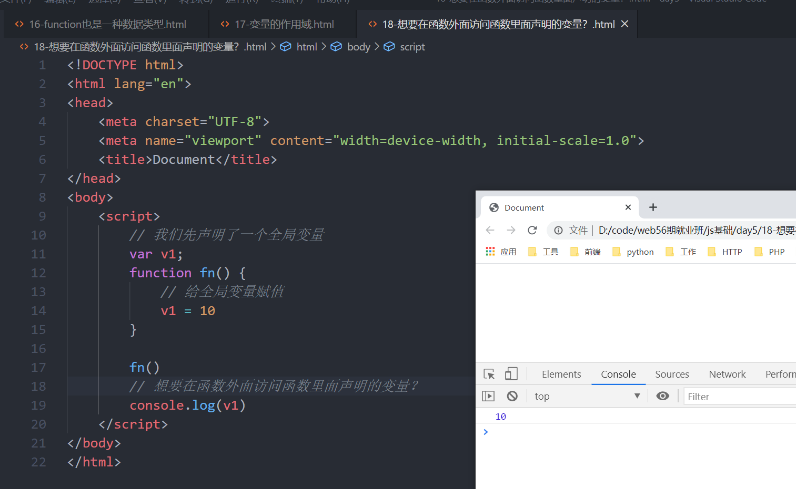

# 函数

为什么需要使用函数？

下面有5个数组，请分别求出每一个数组中的最小值

```js
var arr1 = [1,2,3,4,5,6]
var arr2 = [11,12,13,14,15,6]
var arr3 = [11,2,13,14,15,6]
var arr4 = [11,12,3,14,15,16]
var arr5 = [11,12,13,4,15,16]
```

函数最主要目的：就是为了减少重复的代码量 

定义函数

```js
function 函数名() {
    函数体
}
```

注意点：

关于函数名的命名规则与变量名一模一样

function不能省略不写 一定要有

调用函数

```js
函数名()
```



向这个函数里面传递参数 

关于打招呼  我们定义的这个函数它如何知道跟谁打招呼 

函数的参数两种：形式参数 简称形参  实际参数 简称实参 

形式参数是我们定义函数时，在函数名后面的小括号里面写的变量名  

实际参数 是调用函数时，在函数名后面的小括号里面写的具体的内容或者变量

```html
<!DOCTYPE html>
<html lang="en">
  <head>
    <meta charset="UTF-8" />
    <meta name="viewport" content="width=device-width, initial-scale=1.0" />
    <title>Document</title>
  </head>
  <body>
    <script>
      // 定义函数
      function sayHello(user) {
        console.log(user);
      }
      // 调用函数
      sayHello("隔壁老王");
      sayHello("隔壁老李");
    </script>
  </body>
</html>

```

使用一个函数来实现两个变量的最大值


## 函数的返回值

以后我们在函数体里面很少会有输出语句，都会将函数里面的得到的结果进行返回 

语法：

```js
function 函数名() {
    
    return 要返回的结果
}
```

比如：我们班上有小明和小王这两位同学去同一家公司上班，领导给小明同学提了一个需求：要求在浏览器上面打印一个hello，要求小王在控制台输出hello 

领导写好的一个函数这个函数会有一个结果 

```html
<!DOCTYPE html>
<html lang="en">
  <head>
    <meta charset="UTF-8" />
    <meta name="viewport" content="width=device-width, initial-scale=1.0" />
    <title>Document</title>
  </head>
  <body>
    <script>
      /*
      比如：我们班上有小明和小王这两位同学去同一家公司上班，领导给小明同学提了一个需求：
      要求在浏览器上面打印一个hello，
      要求小王在控制台输出hello 

领导写好的一个函数这个函数会有一个结果 
      */
      function printHello() {
        return "hello";
      }

      // 小明调用领导已经封装好的函数 就可以拿到它的结果了
      var res = printHello(); // 小明同学
      alert(res);
      var res1 = printHello(); // 小王同学
      console.log(res1)
    </script>
  </body>
</html>

```

return关键字有两层含义：

1. 返回结果给函数的调用者
2. 中止函数往下执行



3. return 只能一次返回一个数据，如果需要返回多个，请使用数组或者对象 

案例：求质数 

质数：又称之为素数，只能被1和自身整除的数就是质数

比如：2、3、5、7 、11、13 、17 

- 写一个函数判断一个数字是不是质数，如果是质数就返回true ,如果不是质数就返回false
- 利用这个函数的返回值，将2~100之间所有的质数算出来

代码如下：

```html
<!DOCTYPE html>
<html lang="en">
  <head>
    <meta charset="UTF-8" />
    <meta name="viewport" content="width=device-width, initial-scale=1.0" />
    <title>Document</title>
  </head>
  <body>
    <script>
      /*
          什么是质数：能够被1和自身整除的数字称之为质数 
          反过来说 如果一个数字能够被 除了 1和自身之间的任何一个数字整除 那就说明它不是质数 
          为什么说数字 8 不是质数  它除了能够被1 和 8整除 还可以被  2 和 4 整除 
          比如给个数字给8   我就将 2 3 4 5 6 7 取出来  拿数字 8 % 2 是否等于0  
          写一个函数判断一个数字是不是质数，如果是质数就返回true ,如果不是质数就返回false

          比如为什么7是质数   2 3 4 5 6 
          9   2 3 4 5 6 7 8   
        */
      function isZhiShi(num) {
        for (var i = 2; i < num; i++) {
          // 如果 i变量能够被 num整除 那就说明它不是质数
          if (num % i === 0) {
            return false;
          }
        }
        return true;
      }

      for (var j = 2; j <= 1000; j++) {
        // 在这里来调用函数 得到的函数的返回值
        var flag = isZhiShi(j);
        if (flag === true) {
          document.write(j + "：是质数<br>");
        }
      }
    </script>
  </body>
</html>

```

## 函数的声明方式

第一种：

```js
function 函数名() {
    函数体
}
函数名()
```

第二种：

```js
var 变量名 = function() {
    函数体
}
函数名()
```

其实在js中 存在一个 叫`function`的数据类型


## 变量的作用域

变量在什么地方可以使用，在什么地方不可以使用

只要我们讲到变量的作用域就离不开函数

在函数外面声明的变量我们称之为全局变量，这个变量在整个页面都可以被访问到 

在函数体里面定义的变量我们称之为局部变量，这个变量只能在当前函数里面被访问到


问题：想要在函数外面访问函数里面声明的变量？

只需要将局部变量前面的var关键字去掉就可以 



如果我们将声明变量的var关键字去掉了以后，JS内部会在这个函数的外面声明一个同名的全局变量

